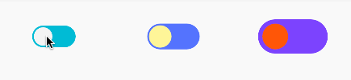

# DayNightToggleButton

A Funny ToggleButton for day and night change

[](https://jitpack.io/#SilenceDut/DayNightToggleButton)


####[sample.apk](https://github.com/SilenceDut/DayNightToggleButton/blob/master/apk/day_night_togglebutton.apk?raw=true) 
(It runs smoothly, but gif is not appear well)

[](https://android-arsenal.com/details/1/4053)
Adding to your project
----------------------
This library is available through JitPack.

Step 1. Add the JitPack repository to your build file

```groovy
allprojects {
    repositories {
        ...
        maven { url "https://jitpack.io" }
    }
}
```

Step 2. Add the dependency

```groovy
compile 'com.github.SilenceDut:DayNightToggleButton:{latest-version}'
```

Basic Usage
-------------------
 Ways 1:set appearance in xml 

```xml
<com.silencedut.daynighttogglebutton.DayNightToggleButton
            android:layout_centerInParent="true"
            android:layout_width="50dp"
            android:layout_height="25dp"
            app:dnBackgroundCheckedColor="#5677fc"
            app:dnBackgroundUncheckedColor="#00bcd4"
            app:dnToggleCheckedColor="#FFF59D"
            app:dnToggleUncheckedColor="#F5F5F5"
            app:dnDuration="500"
            app:dnToggleWithAnimate="false"
            />
```

Way 2: set appearance in Java  

```java
DayNightToggleButton mButtonWithBuilder = (DayNightToggleButton)findViewById(R.id.day_night_with_builder);

ToggleSettings mBuilderSettings = new ToggleSettings.Builder()
        .setToggleUnCheckedColor(getResources().getColor(R.color.colorAccent))
        .setBackgroundUncheckedColor(getResources().getColor(R.color.blue500))
        .buildSettings();
        
mButtonWithBuilder.setToggleSettings(mBuilderSettings);
```

Support setting:
```xml
<declare-styleable name="DayNightToggleButton">
        <attr name="dnTogglePadding" format="dimension|reference"/>
        <attr name="dnToggleUncheckedColor" format="color|reference"/>
        <attr name="dnToggleCheckedColor" format="color|reference"/>
        <attr name="dnBackgroundUncheckedColor" format="color|reference"/>
        <attr name="dnBackgroundCheckedColor" format="color|reference"/>
        <attr name="dnToggleWithAnimate" format="boolean"/>
        <attr name="dnDuration" format="integer"/>
</declare-styleable>

```

License
-------

    Copyright 2015-2016 SilenceDut

    Licensed under the Apache License, Version 2.0 (the "License");
    you may not use this file except in compliance with the License.
    You may obtain a copy of the License at

       http://www.apache.org/licenses/LICENSE-2.0

    Unless required by applicable law or agreed to in writing, software
    distributed under the License is distributed on an "AS IS" BASIS,
    WITHOUT WARRANTIES OR CONDITIONS OF ANY KIND, either express or implied.
    See the License for the specific language governing permissions and
    limitations under the License.